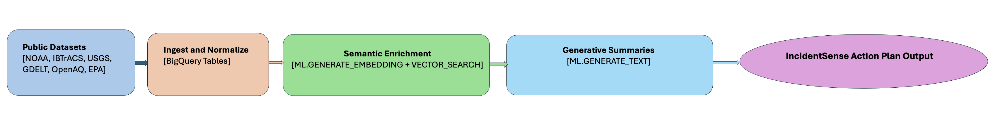

# IncidentSense - AI Powered Disaster Intelligence in BigQuery  

## A SQL-first disaster intelligence system that unifies hazard data, enriches it with context, & generates summary and action list in minutes.

### Problem Statement
When disasters strike, emergency managers and humanitarian analysts must act quickly. Today, they spend hours manually collecting data from NOAA, GDELT, OpenAQ, and other fragmented sources, then summarizing key details before decisions can be made. This lag in situational awareness can delay response and cost lives. My solution leverages BigQuery AI to unify hazard feeds, enrich them with population and infrastructure context, and automatically generate human-ready briefs and action plan — all directly in SQL.

### Solution in SQL

### Method and Description
https://medium.com/@chandrasekhar.aish/incidentsense-ai-powered-disaster-intelligence-in-bigquery-646d0a316a01